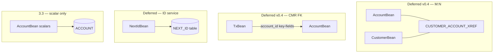

# CMP→JPA capability matrix — Duke's Bank (3.1a)

**Status:** Accepted (ADR-007 §3.1a)  
**Date:** 2026-06-27  
**Scope:** Classify all four EJB 2.x **CMP entity beans** in the Duke's Bank **bank module** for the `rewrite-recipes` stack-migration program.  
**Out of scope:** Session beans (`*ControllerBean`, `TellerBean`) — see [ADR-007 §3.1b–3.2](https://github.com/anchor-migration/migration-hub/blob/main/docs/ADR-007-rewrite-recipes-session-and-cmp-jpa.md).

**Related:** [ADR-007](https://github.com/anchor-migration/migration-hub/blob/main/docs/ADR-007-rewrite-recipes-session-and-cmp-jpa.md) · [DUKESBANK-DEMO](https://github.com/anchor-migration/migration-hub/blob/main/docs/DUKESBANK-DEMO.md) · [ADR-004 crosswalk contract](https://github.com/anchor-migration/migration-hub/blob/main/docs/ADR-004-crosswalk-contract-mapping-roles-and-edge-kinds.md) · [recipe-families.md](recipe-families.md)

---

## 1. Purpose

Before implementing **3.3 `CmpScalarEntityToJpa`**, this matrix answers:

1. Which Duke's Bank CMP patterns are **automatable in v0.1–3.3** vs **deferred**.
2. Why **`AccountBean` only** is the first entity recipe (B2 in ADR-007).
3. What **SSOT / XML evidence** already exists vs what recipes must infer from source.

**Proof for 3.1a:** this document + E2E crosswalk stats (below) + OpenRewrite parse spike (harness test `DukesBankStyleHarnessTest`).

---

## 2. Evidence sources

| Source | Role | Verified |
|--------|------|----------|
| `dd/ejb/ejb-jar.xml` | CMP fields, CMR roles, EJB-QL finders, `cmp-version=2.x` | E2E code SSOT export |
| `dd/ejb/jbosscmp-jdbc.xml` | Table/column bindings, relation-table mapping, FK key-fields | E2E + crosswalk |
| `java-ast-ssot` linked SSOT | `persistent_entity` links, edge colors | **32 links, 0 issues** (2026-06-27) |
| `db-metadata` schema SSOT | 5 tables, 27 columns, PKs | Phase A verify green |
| Duke's Bank `.java` abstract CMP beans | Accessor pairs, `EntityBean` callbacks | Manual / export |

**Source tree (external clone):**

```
dukesbank/src/j2eetutorial14/examples/bank/
  src/com/sun/ebank/ejb/{account,customer,tx,util}/
  dd/ejb/{ejb-jar.xml,jbosscmp-jdbc.xml,jboss.xml}
```

Runbook: [DUKESBANK-DEMO § E2E](https://github.com/anchor-migration/migration-hub/blob/main/docs/DUKESBANK-DEMO.md#e2e-quick-path).

---

## 3. Crosswalk alignment (Phase C baseline)

E2E linked SSOT (`dukesbank-linked.db`) — **all four entities**:

| Metric | Value |
|--------|-------|
| Links written | **32** |
| Crosswalk errors | **0** |
| Forward green edges | **32** |
| `type_maps_to_table` | 4 (one per entity) |
| `stack_bridge` | 4 |
| `field_maps_to_column` | **24** (scalar CMP fields only) |

**Interpretation:** Scalar column bindings are **fully aligned** (green) for all four entities. CMR collections and EJB-QL are **not** represented as `field_maps_to_column` — they require separate recipes and (for xref) `relationship_maps_to_table` edges (ADR-004 planned).

**Re-verify after any descriptor or schema change:**

```powershell
cd demo-dukesbank
.\scripts\run-e2e.ps1
# Explorer: load java-ast-ssot/metadata/dukesbank-linked.db → Links: 32, Issues: 0
```

---

## 4. Entity inventory

All four beans: **`persistence-type=Container`**, **CMP 2.x**, **abstract** Java class + container-generated concrete subclass, **local + home** interfaces (EJB 2.x client view).

| Entity | Java package | Table | Scalar CMP fields | CMR / relationships | EJB-QL finders (ejb-jar.xml) |
|--------|--------------|-------|-------------------|---------------------|------------------------------|
| **`AccountBean`** | `...ejb.account` | `ACCOUNT` | **7** | `customers` → M:N via **`CUSTOMER_ACCOUNT_XREF`** | `findByCustomerId` |
| **`CustomerBean`** | `...ejb.customer` | `CUSTOMER` | **9** | `accounts` → M:N (inverse) | `findByAccountId`, `findByLastName` |
| **`TxBean`** | `...ejb.tx` | `TX` | **5** | `account` → **`@ManyToOne`-style** FK (`account_id` in `jbosscmp-jdbc` key-fields) | (used via controllers / queries) |
| **`NextIdBean`** | `...ejb.util` | `NEXT_ID` | **2** | none | n/a (sequence helper) |

### 4.1 Scalar field sketch (descriptor-driven)

Exact names come from **`jbosscmp-jdbc.xml`** `<cmp-field>` / `<column-name>` (crosswalk source of truth).

| Entity | Representative scalars | PK |
|--------|------------------------|-----|
| `AccountBean` | `accountId`, `type`, `description`, `creditLimit`, `balance`, `beginDate`, `createdDate` | `accountId` → `ACCOUNT_ID` |
| `CustomerBean` | `customerId`, name/address/contact fields (9 total) | `customerId` |
| `TxBean` | `txId`, `time`, `amount`, `description`, (+ FK via CMR role `account`) | `txId` |
| `NextIdBean` | `beanName`, `id` (table-backed counter per entity name) | composite / bean name key |

**Java types (typical):** `String` PKs; `BigDecimal` for money; `java.util.Date` for dates — all **green** type alignment in crosswalk for linked scalars.

### 4.2 Relationship complexity (why order matters)



---

## 5. Capability matrix (recipe program)

Legend: **✅ 3.3** = first CMP recipe wave · **🟡 v0.4+** = follow-on · **❌** = out of v0.1 scope · **—** = not present in Duke's Bank

| Capability | Duke's Bank evidence | Program phase | Verdict |
|------------|---------------------|---------------|---------|
| CMP 2.x abstract accessors → JPA fields | All 4 entities | **3.3** (`AccountBean` first) | ✅ Automatable (scalar) |
| `@Table` / `@Column` from `jbosscmp-jdbc.xml` | All 4 entities mapped | **3.3** | ✅ Prefer linked SSOT + XML SSOT in 3.3+ |
| String `@Id` | All entities | **3.3** | ✅ |
| `BigDecimal`, `Date` scalars | Account, Tx | **3.3** | ✅ |
| Remove empty `EntityBean` callbacks (`ejbLoad`/`ejbStore`/…) | Often no-op in tutorial | **3.3 partial** | 🟡 Separate cleanup recipe step |
| **`@ManyToMany` + join table** | `account`↔`customer`, `CUSTOMER_ACCOUNT_XREF` | **v0.4** | 🟡 Deferred — needs both sides + xref SSOT |
| **CMR `@ManyToOne` / `@OneToMany`** | `tx`→`account`, key-fields in JDBC XML | **v0.4** | 🟡 Deferred |
| **EJB-QL → `@NamedQuery` / JPQL** | 3+ finder queries in `ejb-jar.xml` | **v0.5+** | 🟡 Separate recipe family |
| **Local / Home / Remote** interface removal | Full EJB 2.x graph | **v0.5+** | 🟡 Cross-cutting; after entities |
| **`NextIdBean` table sequence** | `NEXT_ID` table counters | **v0.4+** | 🟡 Replace with `@GeneratedValue`, sequence, or service |
| Container-generated concrete CMP subclass | JBoss generates impl | **3.3 spike** | 🟡 Recipe targets **abstract `.java` only**; delete/regenerate concrete |
| BMP / compound PK / read-only CMP | — | — | ❌ Unsupported v0.1 |
| Vendor CMP beyond JBoss DTD | JBoss `jbosscmp-jdbc.xml` only | **3.3** | ✅ JBoss path first; WebLogic/WebSphere profiles later |
| Java 1.4 syntax (raw types) in **surrounding** code | Controllers, DTOs | **3.0** harness | ✅ OpenRewrite 8.85.6 parses (see harness test) |

---

## 6. Per-entity migration verdict

| Entity | Scalar `@Entity` (3.3) | Relationships | Finders | Recommended phase |
|--------|------------------------|---------------|---------|-------------------|
| **`AccountBean`** | **✅ First target** — 7 fields, 1 table, no FK on entity table | Exclude `customers` CMR in 3.3 | Defer `findByCustomerId` | **3.3** |
| **`CustomerBean`** | ✅ Same recipe *pattern* as Account | Exclude `accounts` M:N | Defer 2 finders | **v0.4** (after M:N recipe) |
| **`TxBean`** | ✅ Scalar fields migratable | Requires `account` CMR → `@ManyToOne` | Defer | **v0.4** (after FK CMR recipe) |
| **`NextIdBean`** | ⚠️ Technically 2 fields | N/A — **semantic** change (ID generation) | N/A | **v0.4+** — service/sequence, not drop-in `@Entity` |

### 6.1 Why `AccountBean` first (3.3 scope lock)

| Criterion | `AccountBean` | Others |
|-----------|---------------|--------|
| Scalar-only recipe sufficient for useful demo | ✅ | ❌ Tx/Customer need relations for faithful behavior |
| Crosswalk green scalars | ✅ 7 fields | ✅ but coupled to CMR in app logic |
| Risk of silent semantic change | Low (no FK on `ACCOUNT` row) | Higher for Tx (account FK) and NextId (ID service) |
| Teaches `@Table`/`@Column` from SSOT | ✅ Best first fixture | Same pattern, later |

**3.3 explicit exclusions (AccountBean):**

- ❌ `getCustomers` / `setCustomers` and CMR collection type
- ❌ `AccountLocal`, `AccountHome`, remote interfaces
- ❌ EJB-QL `findByCustomerId`
- ❌ Changes to `AccountControllerBean` or other session beans

**3.3 acceptance (preview for recipe author):**

- [x] `@Entity` class with 7 scalar fields; `@Table(name="ACCOUNT")`; `@Column` names match **crosswalk** / `jbosscmp-jdbc.xml`
- [x] `rewrite-test` before/after on abstract bean fixture (`AccountBeanCmpToJpaTest`)
- [ ] Re-export code SSOT + crosswalk: **32 links**, **0 issues** (manual post-apply)
- [x] No `@ManyToMany` / `@OneToMany` on `AccountBean` in 3.3

---

## 7. Parse spike (OpenRewrite × Java 1.4 idioms)

**Question:** Can OpenRewrite parse Duke's Bank-era sources for recipe tests?

**Result:** ✅ Yes for harness purposes.

| Check | Evidence |
|-------|----------|
| Raw `ArrayList` / `Collection` / `Iterator` | `DukesBankStyleHarnessTest` — `OrderImports` on controller-style snippet |
| JDK for tests | `rewrite-java-17` on classpath; sources parsed as legacy syntax |
| Docker parity | `.\scripts\run-test.ps1` — same as CI JDK 17 |

**Limitation:** Full `AccountBean.java` with abstract CMP accessors + EJB interfaces not yet in rewrite-test fixtures; **3.3** will add entity-specific fixtures. Parsing Java **1.4** **entity** sources may need `--release` / parser options spike when implementing 3.3.

---

## 8. SSOT usage in CMP recipes (phased)

| Phase | SSOT input | Usage |
|-------|------------|-------|
| **3.1a** (this doc) | Linked DB stats + XML | Scope decisions only |
| **3.3** | Optional `dukesbank-linked.db` | Validate `@Column(name=…)` against `field_maps_to_column` targets |
| **v0.4+** | Linked DB + schema SSOT | M:N xref table, FK columns, relationship edge kinds |

Recipes **must not write** SSOT files ([ADR-007 boundary protocol](https://github.com/anchor-migration/migration-hub/blob/main/docs/ADR-007-rewrite-recipes-session-and-cmp-jpa.md)).

---

## 9. Production CMP vs Duke's Bank (expectation management)

Duke's Bank is **typical tutorial EJB 2.x CMP** — simpler than many enterprise codebases:

| Pattern | Duke's Bank | Common in production | v0.1 program |
|---------|-------------|----------------------|--------------|
| Entity count | 4 | 50–500+ | One entity per recipe wave |
| BMP | No | Sometimes | ❌ |
| Compound PK | No | Yes | ❌ |
| Read-only entities | No | Yes | ❌ |
| Heavy EJB-QL | Light (3 finders) | Extensive | Deferred |
| Vendor extensions | JBoss only | Multi-vendor | JBoss profile first |

**Conclusion (ADR-007 Critic + this matrix):** Duke's Bank is a **valid scalar CMP→JPA demo** and crosswalk driver; it **under-represents** relationship and finder complexity — all explicitly deferred above.

---

## 10. Recommended recipe sequence (post-3.1a)

| Step | Recipe (planned name) | Entity / concern |
|------|----------------------|------------------|
| **3.3** | `CmpScalarEntityToJpa` | `AccountBean` scalars only |
| **v0.4a** | `CmpManyToManyToJpa` | `AccountBean`↔`CustomerBean` + xref |
| **v0.4b** | `CmpForeignKeyToJpa` | `TxBean.account` |
| **v0.4c** | `CmpScalarEntityToJpa` | `CustomerBean`, then `TxBean` scalars |
| **v0.4d** | `NextIdToSequence` or delete-after-migration | `NextIdBean` |
| **v0.5** | `EjbQlToNamedQuery` | Finder queries |
| **v0.5** | `RemoveEjbLocalHome` | Interface graph |

Update [recipe-families.md](recipe-families.md) when each recipe is scheduled.

---

## 11. Sign-off

| Role | Assessment |
|------|------------|
| **Pragmatist** | 3.3 scope locked; matrix sufficient to start 3.2 session chain / 3.3 planning |
| **Critic** | M:N, FK CMR, NextId, EJB-QL explicitly deferred — no hidden scope |
| **Suggester** | Optional: add `relationship_maps_to_table` crosswalk edges before v0.4a |

**Next gate:** **v0.4** — CMR / relationship CMP recipes ([ADR-007](https://github.com/anchor-migration/migration-hub/blob/main/docs/ADR-007-rewrite-recipes-session-and-cmp-jpa.md)); 3.3 scalar `AccountBean` complete — [cmp-scalar-entity-to-jpa-account-bean.md](cmp-scalar-entity-to-jpa-account-bean.md).

---

## Changelog

| Date | Change |
|------|--------|
| 2026-06-27 | Initial 3.1a matrix — refines ADR-007 §3 capability table |
